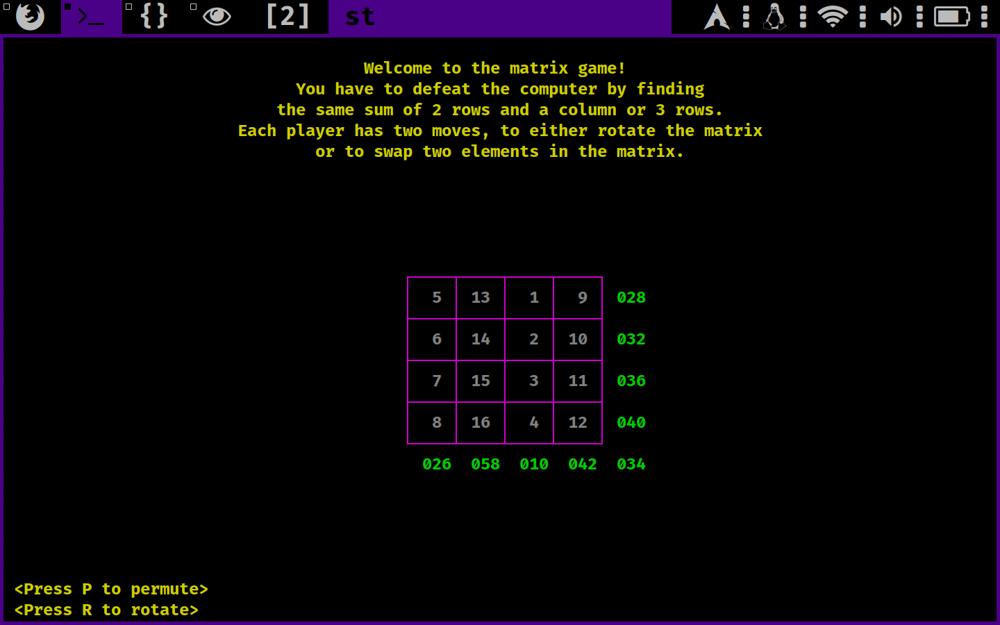

<div align="center">

# `Matrix Game`

<h4>
  A game where a player has to defeat the computer by finding the same sum of 2 matrix rows and a column or 3 rows. Each player has two moves, to either rotate the matrix or to swap two elements in the matrix.
</h4>

<!-- Badges -->


<!-- Demo image -->


</div>

<!-- TABLE OF CONTENTS -->
## Table of Contents

* [Project Structure 📁](#project-structure)
* [Install 🔨](#install)
* [Use 🚀](#use)
* [Develop ⚙️](#develop)
* [License 📑](#license)

## Project Structure 📁
```
matrix_game/
├── src/
│   └── matrix_game.c
│
├── AUTHORS
├── demo.png
├── LICENSE
├── Makefile
├── matrix_game
└── README.md
```

## Install 🔨
- Install from github: 
```shell
$ git clone https://github.com/nemo256/matrix_game
$ cd matrix_game
$ make
$ make clean install
```
## Use 🚀
> matrix_game <size_of_matrix>
- Using 5 as the size:
```shell
$ matrix_game 5
```
- Press R or P to either rotate the matrix or permute two values.

## Develop ⚙️
- Download the project:
```shell
$ git clone https://github.com/nemo256/matrix_game
$ cd matrix_game
```
- Now change <src/matrix_game.c> (using vim):
```shell
$ vim src/matrix_game.c
```
- Now just run make to compile the project:
```shell
$ make
$ make clean install
$ matrix_game 3
```

## License 📑
- Please read [matrix_game/LICENSE](https://github.com/nemo256/matrix_game/blob/master/LICENSE)

